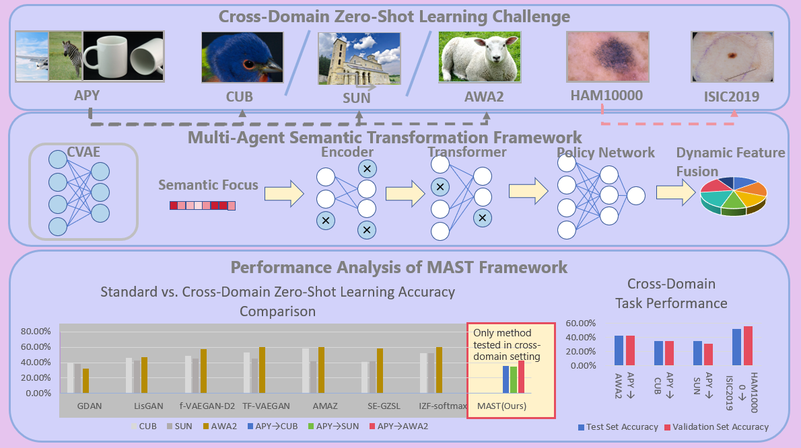

# MAST: Multi-Agent Semantic Transformation for Cross-Domain Zero-Shot Learning

This repository contains the official implementation of "Multi-Agent Semantic Transformation (MAST)" for cross-domain zero-shot learning as described in our paper **Multi-Agent Collaborative Semantic Transformation for Cross-Domain
 Zero-Shot Learning**.

## Overview
MAST is a novel framework that facilitates cross-domain zero-shot learning through collaborative semantic transformation and alignment. It features a multi-agent parallel network extracting diverse semantic features, coupled with a cross-domain alignment mechanism that effectively minimizes domain differences.



## Requirements
- Python 3.7+
- PyTorch 1.7+
- scikit-learn
- numpy
- scipy
- matplotlib (for visualizations)

Install requirements:
```
pip install -r requirements.txt
```

## Dataset Preparation
The repository doesn't include datasets due to size limitations. Please download the required datasets separately and organize them as follows:

### Standard Datasets (APY, AWA2, CUB, SUN)
1. Download these datasets from their official sources.
2. Place them in the corresponding folders under the `data/` directory.
3. Each dataset folder should contain:
   - `res101.mat`: Feature vectors
   - `att_splits.mat`: Attribute features and data splits

### Medical Datasets (HAM10000, ISIC2019)
For these datasets, additional preprocessing is required:

1. Download the datasets from their official sources:
   - HAM10000: [https://dataverse.harvard.edu/dataset.xhtml?persistentId=doi:10.7910/DVN/DBW86T](https://dataverse.harvard.edu/dataset.xhtml?persistentId=doi:10.7910/DVN/DBW86T)
   - ISIC2019: [https://challenge.isic-archive.com/data/#2019](https://challenge.isic-archive.com/data/#2019)

2. Organize the raw data as follows:
   ```
   data/medical/raw/ham10000/
   ├── images/
   │   ├── HAM10000_images_part_1/
   │   └── HAM10000_images_part_2/
   └── metadata.tab
   
   data/medical/raw/isic2019/
   ├── images/
   │   └── ISIC_2019_Training_Input/
   ├── ISIC_2019_Training_Metadata.csv
   └── ISIC_2019_Training_GroundTruth.csv
   ```

3. Generate semantic attributes for skin lesion datasets:
   ```
   python scripts/generate_attributes.py
   ```
   This script guides you through creating 64-dimensional semantic attributes for skin lesion categories using ChatGPT. Save the generated attributes as JSON files in `data/medical/semantic_attributes/`.

4. Process the HAM10000 dataset:
   ```
   python scripts/process_ham10000.py
   ```
   This script extracts ResNet101 features from images, creates train/test splits, and handles semantic attributes. We specially exclude rare disease classes (DF, BKL, VASC) for cross-domain experiments.

5. Process the ISIC2019 dataset:
   ```
   python scripts/process_isic2019.py
   ```
   This script processes ISIC2019 similarly, selecting the 3 rarest disease types as unseen classes.

6. Fix any index inconsistencies:
   ```
   python scripts/fix_indices.py
   ```
   This ensures that class labels are consecutive integers starting from 0.

7. Verify that each medical dataset folder contains properly formatted data:
   ```
   python scripts/inspect_indices.py
   ```
   This checks that `res101.mat` and `att_splits.mat` files are correctly structured.

## Project Structure
```
.
├── configs/                # Configuration files
│   └── cross_domain.yaml   # Main configuration for cross-domain experiments
├── models/                 # Model definitions
│   ├── gdan.py             # GDAN model components
│   └── semantic_transform.py # Multi-agent semantic transformation
├── scripts/                # Data preprocessing scripts
│   ├── generate_attributes.py  # Generate semantic attributes
│   ├── process_ham10000.py     # Process HAM10000 dataset
│   └── process_isic2019.py     # Process ISIC2019 dataset
├── utils/                  # Utility functions
├── pretrain_gdan.py        # Pretraining script
├── train_gdan.py           # Training script
├── eval_gdan.py            # Evaluation script
└── visualize_comprehensive.py  # Visualization and analysis script
```

## Training and Evaluation

### Pretraining
```
python pretrain_gdan.py --config configs/cross_domain.yaml
```

### Cross-Domain Training
```
python train_gdan.py --config configs/cross_domain.yaml
```

### Evaluation
```
python eval_gdan.py --config configs/cross_domain.yaml
```

## Visualization and Analysis

The repository includes a comprehensive visualization tool to analyze model performance and agent behavior:

```
python visualize_comprehensive.py
```

This script generates detailed visualizations showing:
1. Model accuracy over training epochs
2. Agent weight distributions and their entropy
3. Cross-domain semantic alignment loss analysis

The visualization highlights the best performing model epoch and provides insights into the relationship between agent collaboration patterns and model performance. The output is saved as a PDF file for inclusion in publications or presentations.

## Key Parameters in Configuration

The `cross_domain.yaml` file contains important parameters:
- `source_data_name`: Source domain dataset
- `target_data_name`: Target domain dataset
- `num_agents`: Number of semantic transformation agents
- `agent_weight`: Weight for agent cooperation loss
- `entropy_weight`: Weight for agent diversity loss
- `routing_temperature`: Temperature parameter (τ) for softmax

## Results
Our method achieves state-of-the-art performance in cross-domain zero-shot learning tasks:
- APY → AWA2: 42.83% accuracy
- APY → CUB: 35.37% accuracy
- APY → SUN: 34.86% accuracy
- In medical imaging (HAM10000 → ISIC2019): 52.13% accuracy

## Citation
If you find this code useful for your research, please consider citing our paper:
```
@misc{mast2025,
  author = {Yutong Cai},
  title = {Multi-Agent Semantic Transformation for Cross-Domain Zero-Shot Learning},
  year = {2025},
  publisher = {GitHub},
  journal = {GitHub repository},
  howpublished = {\url{https://github.com/YuTong-Cai2001/MAST}}
}
```

Note: This work is currently under review. Once published, we will update the citation information.

## License
This project is licensed under the [MIT License](LICENSE).

## Acknowledgements
- This work was supported by the Key Program of National Natural Science Foundation of China [grant number 62136003]; the National Natural Science Foundation of China [grant numbers 62276097, 62372174].
- We thank the authors of the datasets used in this work
